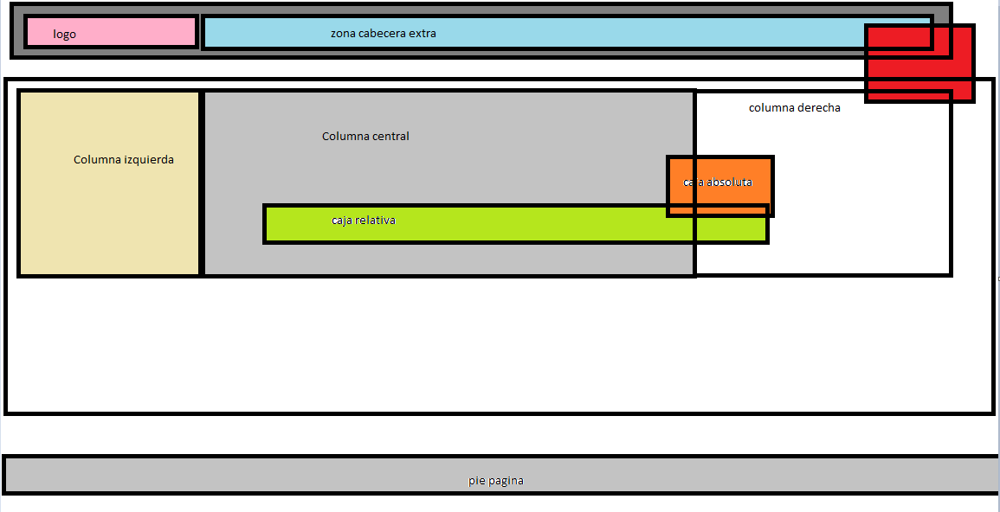

div con logo zona cabecera extra
div rojo
columna izquierda columna central columna derecha la columna central mas grande que las dos la derecha un poco mas grande que la izquierda, la 2 y la tres tienen el mismo ancho que la zona de cabecera extra y la columna izquierda el mismo que el logo, dentro hay flotando una caja relativa y una absoluta
hay un espacio donde al final hay un borde y un pie de página debajo de esta

Buscar informacion sobre svg, como hacer formas y como se rellenan